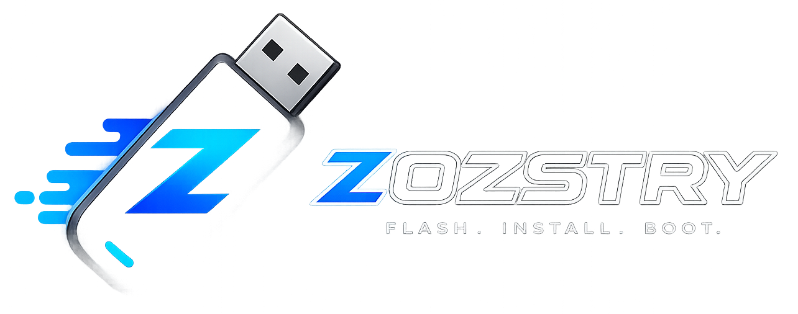

<div align="center">
  

  # ZOZSTRY
  **Ignition Engine for High-Performance Bootable Deployments.**

  [](#)
  [](#)
  [](#)
  
  *Ditch FAT32 Limits. Preserve 4GB+ Windows payloads. Auto-inject OEM Keys. Outsmart UEFI.*
</div>

---

## ⚡ What is Zozstry?

Zozstry is a modern, blazing-fast bootable USB creator architected with React, Tauri, and a low-level Python core. It was specifically engineered to solve the deployment nightmares caused by modern UEFI firmware and massive OS payloads (like Windows 10/11 `.wim` files exceeding the 4GB FAT32 limit)—all without requiring cumbersome file splitting or disabling Secure Boot.

## 🧠 The Core Innovation: **Inverted Phantom Architecture**

Traditional imaging tools fail when writing a >4GB Windows payload to a UEFI-compatible FAT32 drive. They either force you to manually split the files, or they use custom drivers that trigger Secure Boot violations.

**Zozstry solves this natively via physical drive geometry.**

Our custom Python engine executes the **Inverted Phantom Architecture**:
1. **The Inversion:** Zozstry physically formats the USB with a massive **Partition 1 (NTFS)**, followed by a tiny **Partition 2 (FAT32)** at the very end of the drive.
2. **The Routing:** The entire ISO—including the massive `install.wim` payload—is cloned into the NTFS partition. Only the critical EFI bootloaders are copied to the FAT32 partition.
3. **The Firmware Deception:** Motherboard UEFI firmware natively scans the silicon, finds the FAT32 signature at the end of the drive, and boots the PC flawlessly.
4. **The WinPE Handoff:** Because the NTFS payload is sitting in Partition 1, the Windows Preinstallation Environment (WinPE) is forced to mount it as the primary drive. It discovers the payload exactly where it expects it, completely bypassing the notorious "Missing Media Driver" error.

## 🔥 Key Features

* **FAT32 Limit Bypass:** Deploy massive Windows images seamlessly using the NTFS/FAT32 Inverted Phantom layout.
* **OEM Key Auto-Injection:** Zozstry dynamically synthesizes and injects an `ei.cfg` override during the flash. This cures WinPE "split-brain," forcing `setup.exe` to read your motherboard's ACPI MSDM tables and automatically activate your correct Windows edition.
* **Direct-to-Metal Linux Flashing:** Detects Linux ISOs automatically and executes raw, block-by-block hardware writes (`dd`-style) for maximum deployment speed.
* **Hardware Safety Locks:** The engine actively interrogates the WMI/BusType of the selected target. If the device isn't a verified USB removable drive, the engine physically aborts to protect your internal drives.
* **Glassmorphic UI:** Built with React and Framer Motion for a sleek, minimalist, and responsive experience.

## 🛠️ Built With

* **Frontend:** React, Tailwind CSS, Framer Motion
* **App Framework:** Tauri (Cross-platform desktop runtime)
* **Backend Core:** Python (Low-level `ctypes` hardware interaction, WMI polling, and `diskpart` tunneling)

## 🚀 Developer Setup

To run or build Zozstry locally, ensure you have **Node.js**, **Rustup**, and **Python 3.x** installed.

1. **Clone the Repository**
   ```bash
   git clone [https://github.com/ah-REE/zozstry.git](https://github.com/ah-REE/zozstry.git)
   cd zozstry
   ```

2. **Install Frontend Dependencies**
   ```bash
   npm install
   ```

3. **Install Rust Target (Windows)**
   ```bash
   rustup target add x86_64-pc-windows-msvc
   ```

4. **Run in Development Mode**
   ```bash
   npm run tauri dev
   ```

> [!WARNING]  
> **Administrator Privileges Required:** Because the Python engine executes low-level direct disk writes and volume dropping, your terminal (or compiled app) **must be launched as an Administrator** to seize raw hardware handles (`\\.\PHYSICALDRIVE`).

## 🤝 Contributing

Contributions make the open-source community an incredible place to learn and create. Any contributions you make are **greatly appreciated**.

1. Fork the Project
2. Create your Feature Branch (`git checkout -b feature/AmazingFeature`)
3. Commit your Changes (`git commit -m 'Add some AmazingFeature'`)
4. Push to the Branch (`git push origin feature/AmazingFeature`)
5. Open a Pull Request

## 📄 License

Distributed under the MIT License. See `LICENSE` for more information.

---
<div align="center">
  <b>Engineered by ah-REE. Ignited for Performance.</b>
</div>